📊 Data Modeler Project – Building a Star Schema Data Model in Power BI

🎯 Project Overview

This project demonstrates the design and implementation of a professional Star Schema Data Model in Power BI using multiple fact and dimension tables.

The objective was to create a clean, scalable, and efficient data model by applying data modeling best practices, relationship management, hierarchies, and data categorization techniques.

---

🛠️ Tools & Technologies Used

- 📊 Power BI Desktop
- 🔄 Power Query Editor
- 🗂️ Data Modeling
- 📈 Matrix Visualizations
- 🔗 Relationship Management
- 📑 Star Schema Design

---

📂 Dataset Structure

Fact Tables

- Sales_Fact
- Returns_Fact

Dimension Tables

- Customer_Dim
- Product_Dim
- Region_Dim
- Date_Dim

---

🔄 Data Cleaning & Transformation

Data preparation was performed in Power Query to ensure consistency and accuracy before building the model.

Tasks Performed

✔️ Validated data types

✔️ Removed blank records

✔️ Renamed queries

✔️ Verified primary and foreign keys

✔️ Prepared dimension and fact tables for modeling

---

📸 Power Query Transformations

Customer_Dim

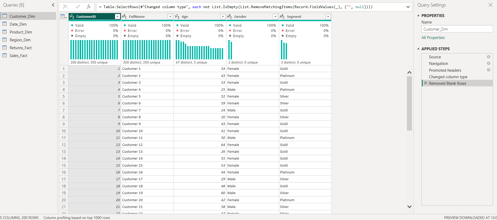

Product_Dim

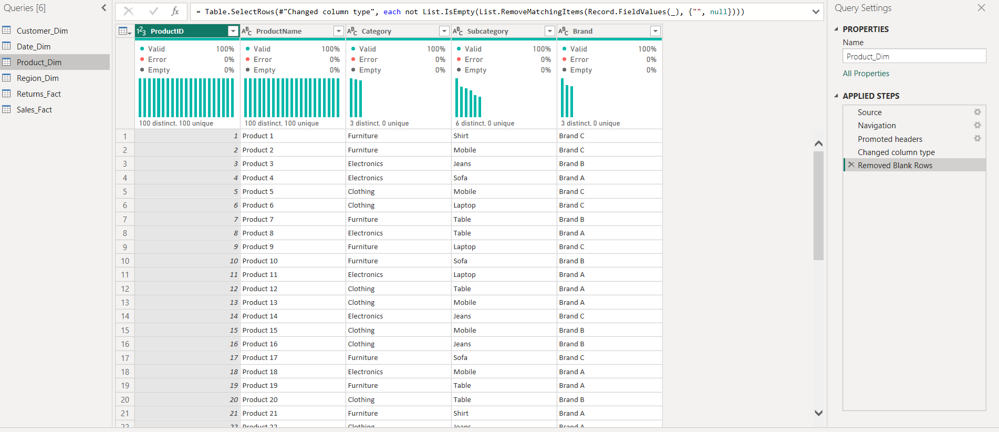

Region_Dim

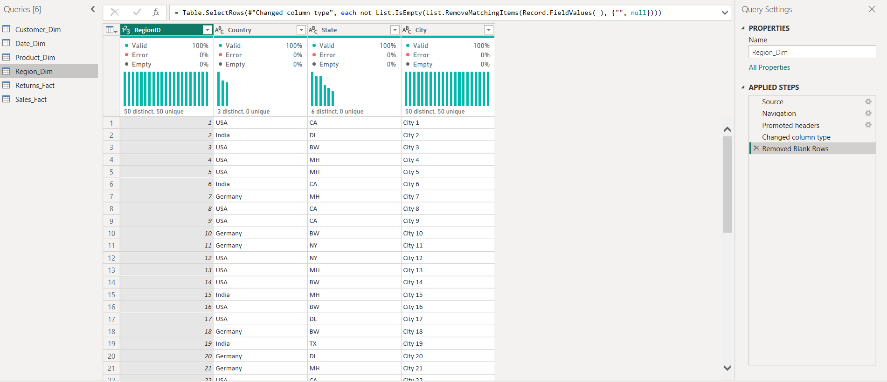

Date_Dim

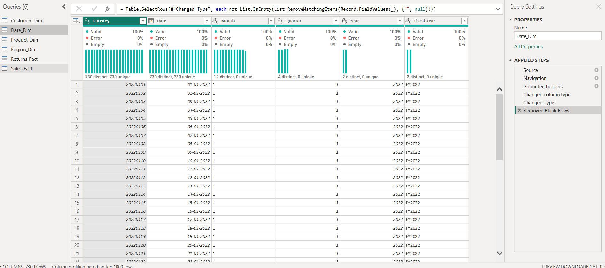

Sales_Fact

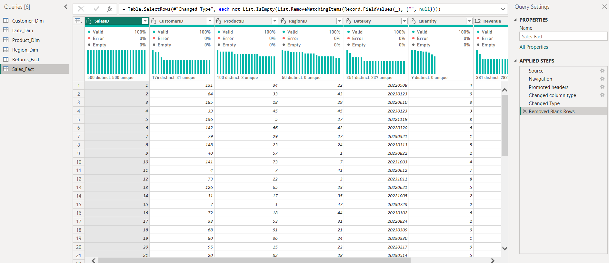

Returns_Fact

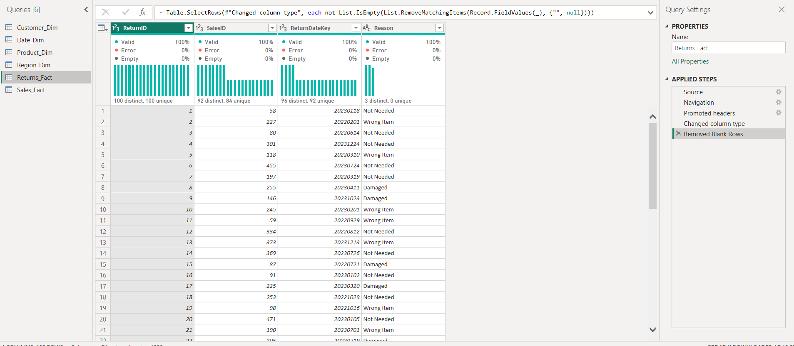

---

⭐ Star Schema Data Model

A Star Schema was implemented with Sales_Fact as the central fact table connected to multiple dimensions.

Relationships Created

- Sales_Fact → Customer_Dim
- Sales_Fact → Product_Dim
- Sales_Fact → Region_Dim
- Sales_Fact → Date_Dim
- Returns_Fact → Sales_Fact
- Returns_Fact → Date_Dim

Model View

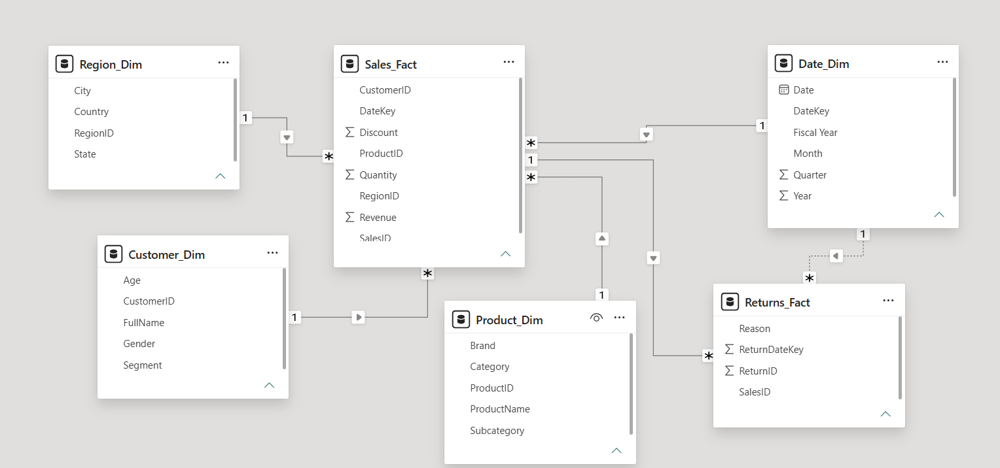

Key Benefits

✔️ Improved query performance

✔️ Simplified reporting structure

✔️ Enhanced scalability

✔️ Industry-standard data warehouse design

---

🔗 Relationship Management

All relationships were manually configured and validated.

Relationship Configuration

- One-to-Many Cardinality
- Single Direction Filtering
- Primary Key to Foreign Key Mapping

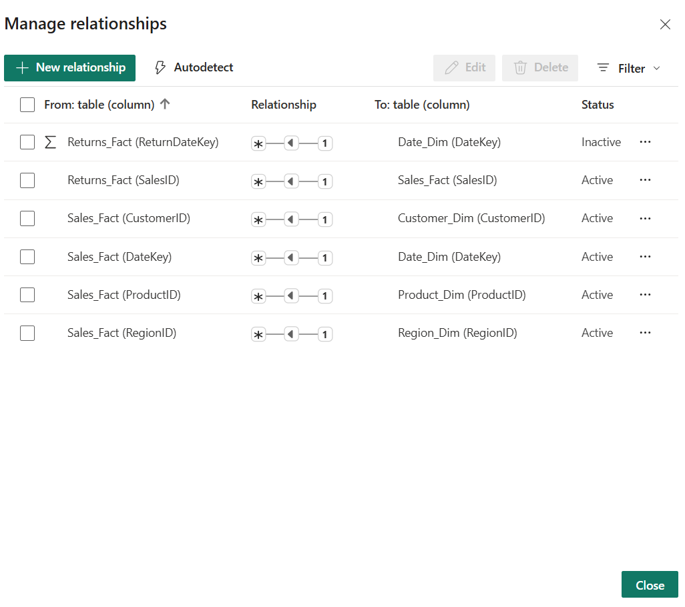

---

⚡ Inactive Relationship

An inactive relationship was created between:

Returns_Fact[ReturnDateKey] and Date_Dim[DateKey]

This helps avoid ambiguity while maintaining flexibility for advanced analysis.

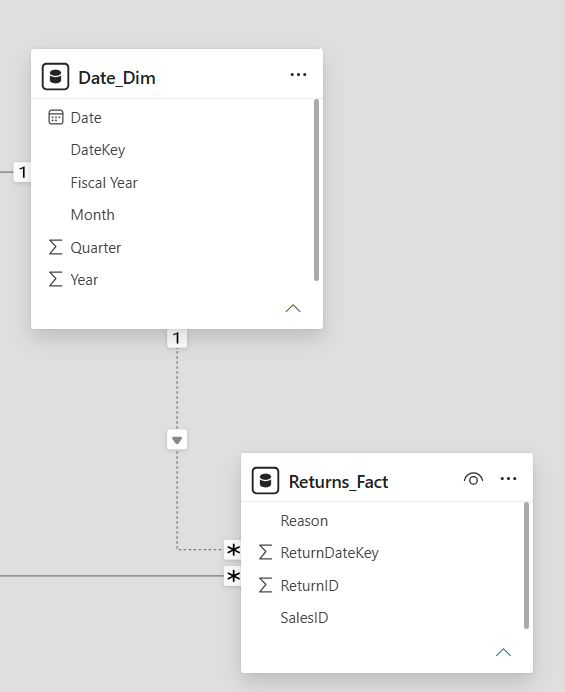

---

🌳 Hierarchies

To improve navigation and drill-down capabilities, custom hierarchies were created.

📅 Date Hierarchy

Year → Quarter → Month → Date

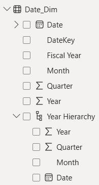

---

📦 Product Hierarchy

Category → Subcategory → Product Name

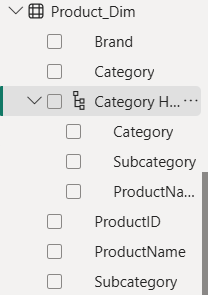

---

🌍 Region Hierarchy

Country → State → City

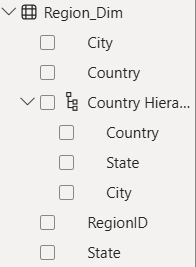

---

🏷️ Data Categories

Data categories were configured to improve geographic recognition and reporting accuracy.

Categories Configured

- Country → Country/Region
- State → State or Province
- City → City

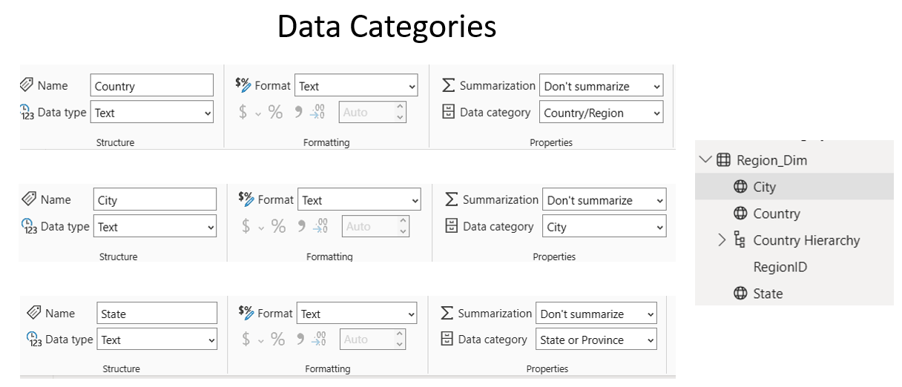

---

📈 Data Model Verification Dashboard

A verification dashboard was created using Matrix Visuals to validate relationships and model behavior.

Revenue by Product Category and Country

Analyzes sales performance across categories and geographic regions.

Return Reasons by Fiscal Year

Identifies return trends and common return reasons over time.

Revenue by Customer Segment

Compares revenue contribution across customer segments.

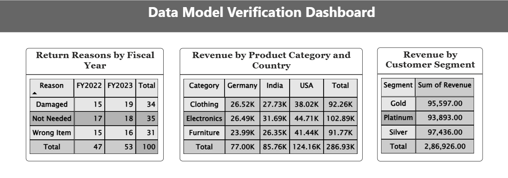

---

🎓 Key Concepts Demonstrated

- ⭐ Star Schema Design
- 🔗 Relationship Management
- 📊 Fact & Dimension Modeling
- 📈 Matrix Visualizations
- 🌳 Hierarchies
- 🏷️ Data Categories
- ⚡ Inactive Relationships
- 📑 Cardinality Management
- 🔄 Power Query Transformations
- 📉 Model Validation

---

🚀 Project Outcome

Successfully designed and implemented a normalized Star Schema Data Model in Power BI by integrating multiple fact and dimension tables, configuring relationships, creating hierarchies, applying data categories, and validating the model through analytical matrix visualizations.

This project demonstrates practical skills in Power BI Data Modeling, Data Preparation, and Relationship Management that are commonly used in business intelligence and analytics solutions.
